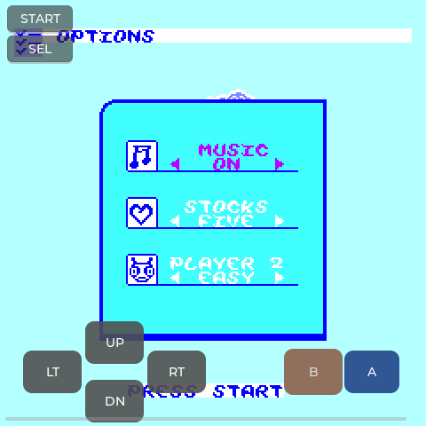
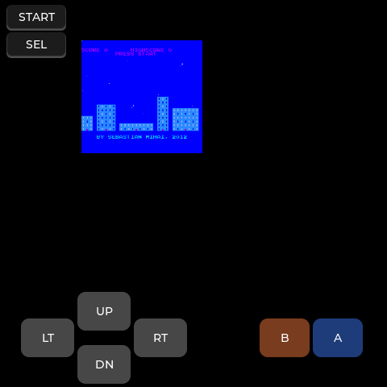
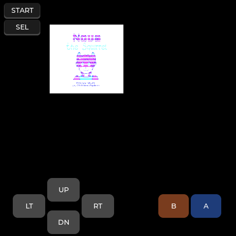
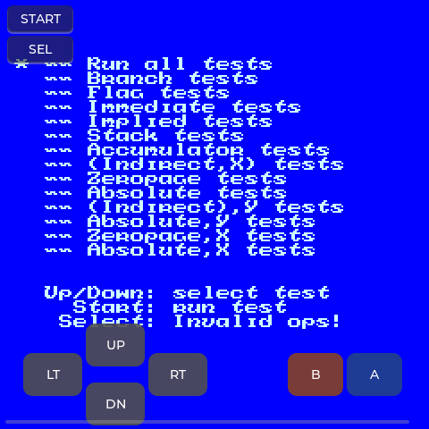
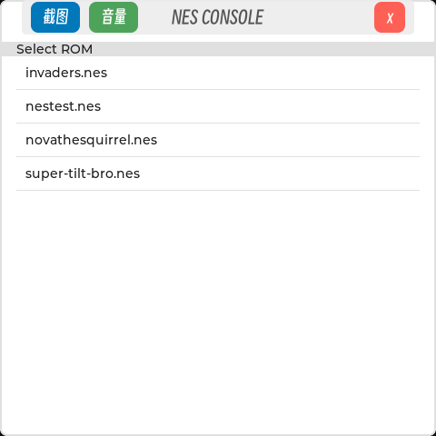
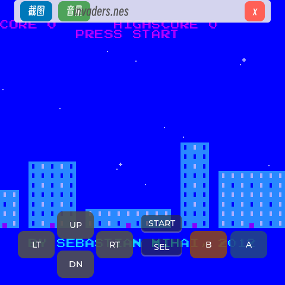
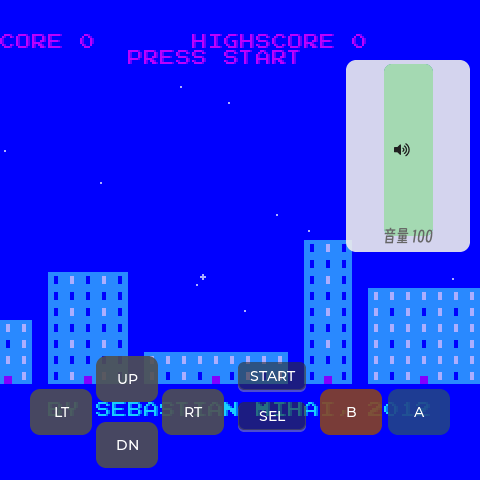

# eMP-nes

NES 模拟器应用（Allwinner T113-S3，LVGL v9 480x480 触摸屏）。

基于 **SimpleNES**（[amhndu/SimpleNES](https://github.com/amhndu/SimpleNES)，GPLv3）核心做无 SFML 嵌入，
架构镜像同门的 [eMP-gba](https://github.com/ZhangKeLiang0627/eMP-gba)：`HAL` 管硬件、`Model` 管生命周期 +
LVGL 线程 + 模拟线程、`View` 管控件。

## 架构

```
main.cpp                     入口：HAL::Init -> Model（常驻睡眠）
src/HAL/                     硬件：fbdev(/dev/fb0) + 多点触控 evdev（含 swipe 检测）+ 信号处理
src/Page/                    Model（菜单-游戏生命周期 + LVGL 线程 + 帧泵）/ View（菜单页 + 游戏页 + overlay）
src/nes_port/
  nes_engine.{h,cpp}         SimpleNES 核心嵌入（6502 解释 + PPU/APU，60fps 实时步进）
  nes_fb.h                   跨线程共享：RGB565 帧缓冲 + 虚拟键表
  nes_font.{c,h}             运行时 CJK 字体（SmileySans.ttf + LVGL tiny_ttf，按需缓存）
  sf_shim_impl.cpp           sf::Keyboard / VirtualScreen 像素 sink 实现
src/sf_shim/                 SFML 类型最小替身（Color/Keyboard/空头），核心零改动编译
src/fs/lv_fs_posix.c         LVGL POSIX FS 驱动（注册 '/'）
libs/lv_conf.h               LVGL 配置（LV_DEF_REFR_PERIOD=16 -> 60fps）
libs/lvgl                    submodule v9.4.0
libs/simplenes               submodule SimpleNES（上游原样，不改）
cmake/build_for_t113s3.cmake eMP-toolchain 规范交叉编译工具链文件（引用即可）
```

## 界面结构（镜像 eMP-gba）

两个页面，页面画布均关闭滚动（拖动不会平移画面）：

- **ROM 菜单页**：列出 ROM 目录下所有 `*.nes` + **常驻顶部栏**（截图 / 音量 / x退出）。
- **游戏页**：NES 画面 2x 全屏 + 底部半透明虚拟键（左下方向、右下 B/A、**B/A 正下方横排 START/SEL**）+ 手势控制的浮层：
  - **下拉 / 上滑**：显示 / 隐藏顶部栏；
  - **左滑 / 右滑**：显示 / 隐藏音量栏（0-100 竖滑条）；
  - 顶部栏「x」退出返回 ROM 菜单（**按住 SELECT 2 秒**同样返回）；
  - 「截图」把当前 /dev/fb0 480x480 画面存为 PPM 到 `/mnt/UDISK/screenshots/`（`EMP_NES_SHOT_DIR` 可改）并弹 toast。

顶部栏 / 音量栏的滑入动画、样式、toast 动画均与 eMP-gba 同款（ease-out 400ms + 展开效果）。

### SimpleNES 如何无 SFML 嵌入

上游核心与 SFML 的耦合只有几个点，全部在 eMP-nes 侧替身解决，submodule 保持原样：

| 上游引用 | eMP-nes 替身 |
|---|---|
| `Controller.h` 轮询 `sf::Keyboard::isKeyPressed` | `src/sf_shim/SFML/Window.hpp`：NES 8 键 = 虚拟键 0..7，读 `NesKey::state[]`（LVGL 虚拟按键写入） |
| `PPU.cpp` PostRender 调 `VirtualScreen::setPixel` 填 `sf::Color` | `sf_shim_impl.cpp` 实现真实头文件的两个方法：直接转 RGB565 写 `NesFb::buffer[]`，零拷贝给 LVGL |
| `APU` 绑定 `AudioPlayer::audio_queue` / `output_sample_rate` | `src/sf_shim/AudioPlayer.h`：同接口但不起音频设备，spsc 满则丢（后续可挂 ALSA 排空） |
| APU 单元残留 `#include <SFML/...>` | 空头占位 |

### 虚拟按键（游戏页底部）

方向（左下）+ B/A（右下）+ START/SEL（B/A 正下方横排）均为半透明覆盖层，按下/抬起直接写
`NesKey::state[]`，核心读 `Controller` 时经 shim 命中，与上游轮询语义一致；多点触控驱动
（每触点一个 POINTER indev）保证「按住方向 + 同时按 A」可用。

## 构建

本地模拟（SDL2 分支未启用，仅交叉）与 T113 交叉编译均走 CMake：

```bash
# 准备子模块
git submodule update --init --recursive

# T113 交叉编译（eMP-toolchain，规范工具链文件）
export T113_SDK="/path/to/eMP-toolchain"      # 含 toolchain/ sysroot/ cmake/
export STAGING_DIR="$T113_SDK/sysroot"
cmake -S . -B build -DCMAKE_TOOLCHAIN_FILE=$T113_SDK/cmake/build_for_t113s3.cmake -DT113_SDK=$T113_SDK
cmake --build build -j
# 产物: build/eMP_nes
```

## 运行（T113 板）

```bash
# 入口优先级：命令行参数 > EMP_NES_AUTOSTART > ROM 选择菜单
./eMP_nes /mnt/UDISK/roms/nes/super_tilt_bro.nes   # 直接进游戏
EMP_NES_AUTOSTART=/mnt/UDISK/roms/nes/nova.nes ./eMP_nes
./eMP_nes                                          # 显示 ROM 菜单（默认目录）
```

环境变量：
- `EMP_NES_ROM_DIR`：菜单扫描目录，默认 **`/mnt/UDISK/roms/nes`**（GBA 放 `/mnt/UDISK/roms/gba`，NES 与 GBA 不混放）
- `EMP_NES_VOLUME`：初始音量 0-100（默认 100）
- `EMP_NES_SHOT_DIR`：截图保存目录（默认 /mnt/UDISK/screenshots）
- `EMP_NES_DEMO_TOP` / `EMP_NES_DEMO_VOL`：启动即展开顶部栏 / 音量栏（演示 / 截图用）

## 板端实测（T113-S3, 2026-09-05）

交叉编译产物直接部署到板子验证（`/root/eMP_nes` + `/mnt/UDISK/roms/nes/*.nes`，fb0 480x480 抓帧）。
显示：NES 原生 256x240，**2x 整数放大填满 480x480**（左右各裁 8px 过扫描，像素 1:4 无重采样）。

| 游戏 | ROM / Mapper | 结果 |
|---|---|---|
| Super Tilt Bro | super-tilt-bro.nes / NROM(0) | 稳定运行，标题有动画 |
| Invaders | invaders.nes / NROM(0) | 稳定运行 |
| Nova the Squirrel | novathesquirrel.nes / **MMC1 + CHR-RAM** | 稳定运行（mapper 1 真机验证）|
| nestest | nestest.nes / NROM(0) | 稳定运行（CPU 测试屏）|

截图（左→右：Super Tilt Bro / Invaders / Nova the Squirrel / nestest）：

| | | | |
|---|---|---|---|
|  |  |  |  |

玩法：底部虚拟 D-pad + B/A + START/SEL（多点触控，可同时按住方向与 A/B）；下拉顶部栏 /
左滑音量栏 / x 退出回菜单 / 长按 SELECT 回菜单；截图按钮存 PPM。
运行命令见上文「运行」一节（板端也可直接 `./eMP_nes /mnt/UDISK/roms/nes/xxx.nes`）。

## 界面组件截图（T113-S3, 2026-09-05）

| ROM 选择菜单（常驻顶部栏）| 游戏页下拉顶部栏 | 游戏页左滑音量栏 |
|---|---|---|
|  |  |  |

（Invaders 运行中抓帧；顶部栏含 截图 / 音量 / x退出，音量栏为 0-100 竖滑条，均照 eMP-gba
样式/动画。滑动展开关闭由手势驱动，本组截图通过 `EMP_NES_DEMO_TOP/VOL` 直接展开渲染。）

## 已知限制（SimpleNES 上游）

- 仅支持 NTSC ROM（PAL 会被明确拒绝）。
- Mapper：NROM(0)/MMC1(1)/UxROM(2)/CNROM(3) 稳定；MMC3(4) 等为实验性。
- 音频：v0 未接 ALSA（帧速率与渲染已通）；后续由 APU spsc 队列接出。

## 授权

SimpleNES 为 GPLv3；本仓库编译其核心，发布二进制时请随附许可证文本与源码获取说明。
